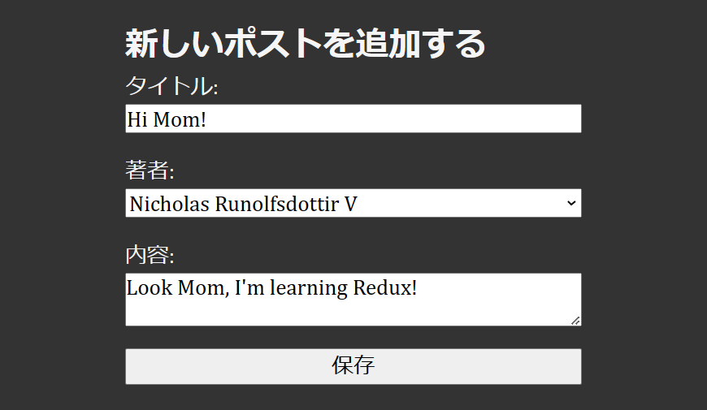
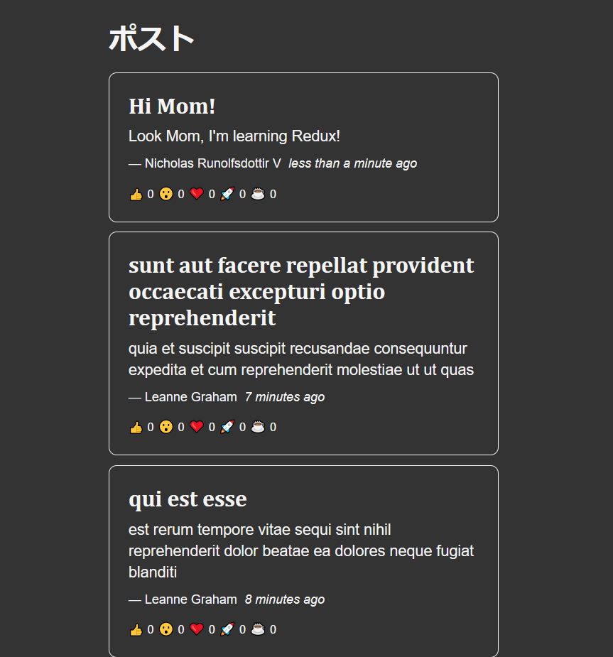

# Chapter 3

This chapter focused on React Thunk Middleware and how it is used for asynchronous actions.

For the backend API, we used [JSON Placeholder | A Free fake API for testing and prototyping](https://jsonplaceholder.typicode.com/).

## Add Post

## Posts

Topics covered:
* Thunk middleware
* Creating async functions using Axios
* Using `extraReducers` to handle Promises
